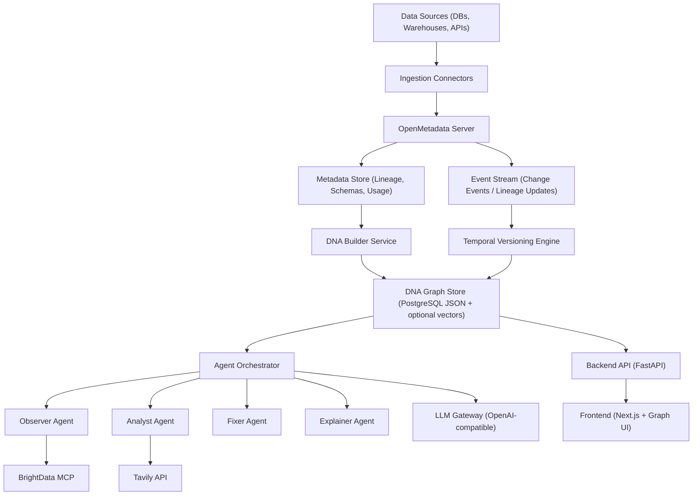

# Living Data DNA Platform

This project builds a **Data DNA Graph** from metadata, tracks mutations over time, and uses AI agents to detect, analyze, and simulate fixes.

## What It Delivers

- OpenMetadata integration module (real REST calls + normalization)
- DNA builder (schema/lineage/usage/ownership genes + trust score)
- Temporal engine (schema diff + lineage diff snapshots)
- Multi-agent pipeline:
  - ObserverAgent (detect issues)
  - AnalystAgent (root cause)
  - FixerAgent (simulate fix + rollback)
  - ExplainerAgent (natural-language summary)
- FastAPI backend endpoints
- Next.js UI with:
  - Dashboard
  - DNA Graph View (React Flow)
  - Timeline View
  - Chat Copilot
- Dockerized stack (PostgreSQL + backend + frontend)

## Architecture



## Quick Start

1. Copy env file:

```bash
cp .env.example .env
```

2. Fill `.env` with real credentials:

- `OPENMETADATA_URL`
- `OPENMETADATA_TOKEN` (if your OpenMetadata requires auth)
- `LLM_API_KEY`
- `TAVILY_API_KEY`
- `BRIGHTDATA_API_TOKEN`

3. Start everything:

```bash
docker compose up --build
```

4. Open UI:

- Frontend: [http://localhost:3000](http://localhost:3000)
- Backend docs: [http://localhost:8000/docs](http://localhost:8000/docs)

## Demo Scenario

You can run this in two modes:

1. Real data mode (default): pull from OpenMetadata.
2. Demo seed mode: set `DEMO_SEED_ENABLED=true` to inject the `sales.orders` mutation storyline.

Dataset: `sales.orders` (demo mode)

Simulated event chain (demo mode):

1. Schema change: `status` renamed to `order_status`
2. Broken lineage edge to `finance.revenue_dashboard`
3. Downstream failure incident
4. Trust score drops from baseline to mutated state

### Demo Flow

1. **Dashboard**: confirm trust score drop and active incident.
2. **DNA Graph**: observe red mutation node + broken lineage edge.
3. **Timeline**: inspect before/after snapshots and schema diff.
4. **Chat Copilot**: ask:
   - "Why did this dataset break?"
   - "Can I trust this data?"

## Backend Endpoints

- `GET /dna/{dataset}`
- `GET /timeline/{dataset}`
- `GET /graph`
- `POST /analyze`
- `POST /simulate-fix`
- `POST /refresh-openmetadata`

Example analyze request:

```bash
curl -X POST http://localhost:8000/analyze \
  -H "Content-Type: application/json" \
  -d '{"dataset":"sales.orders","question":"Why did this dataset break?"}'
```

## LLM Prompts Included

Prompts are defined in `backend/app/services/prompts.py` for:

- Root cause analysis
- Trust scoring rationale
- Explanation generation

There are no mock/fallback LLM paths. Missing required API keys will raise configuration errors.

## Project Structure

```text
backend/
  app/
    api/routes.py
    services/
      openmetadata_client.py
      dna_builder.py
      temporal_engine.py
      prompts.py
      llm_gateway.py
      agents/
frontend/
  app/
    page.tsx
    graph/page.tsx
    timeline/page.tsx
    copilot/page.tsx
  components/
  lib/
```

## Notes

- PostgreSQL stores DNA snapshots, lineage edges, and issues.
- Qdrant can be added later for embeddings (optional extension).
- BrightData MCP is integrated using MCP Streamable HTTP (`https://mcp.brightdata.com/mcp?token=...`) with optional `groups/tools/pro` controls.
